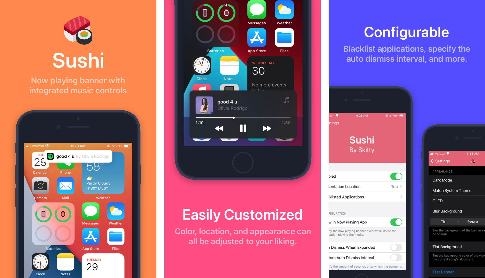

# Sushi
Now playing banner with integrated media controls for iOS 13-16.

## Screenshots

## Installing
Available on https://skitty.xyz/repo/. Compiled debs can also be found in [releases](https://github.com/Skittyblock/Sushi/releases).

## Building
- Setup [Theos](https://theos.dev/) 
- Set `THEOS_PACKAGE_SCHEME=rootless` for rootless building
- Run `make package`
